通过IoT Core Rule Egine连接AWS Kinesis Firehose， 来将IoT设备生成的实时数据存储于S3中.

- 在进行此实验前，请先完成01_connected_publish中的全部内容。

## 1. 创建S3桶

- 此S3桶用于存储IoT设备生成的所有数据

- 进入S3控制台

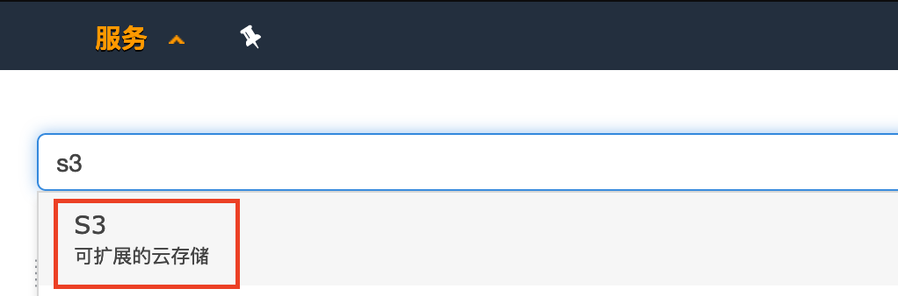

- 创建新的存储桶

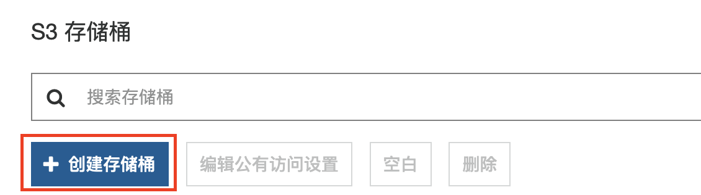

- 给存储桶命名，这里命名为iot-data

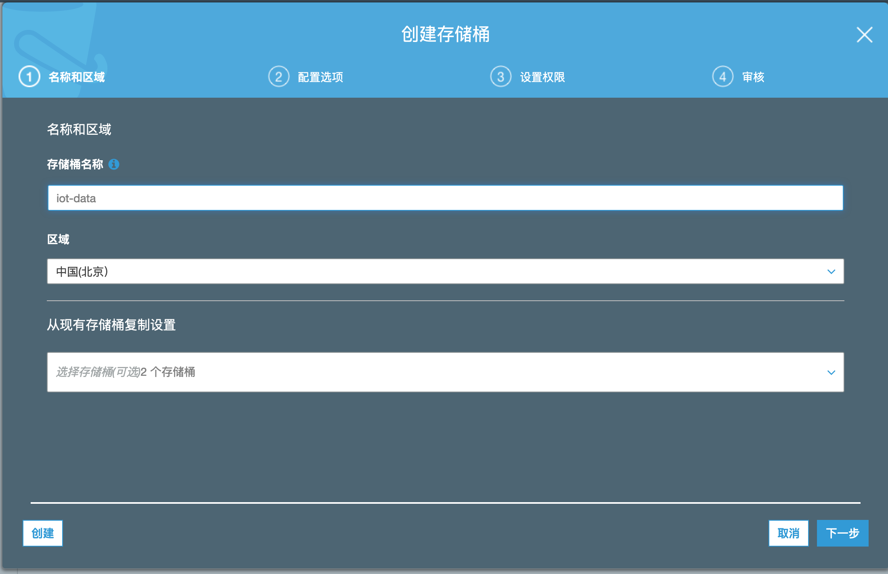

- 之后按照默认设置创建存储桶

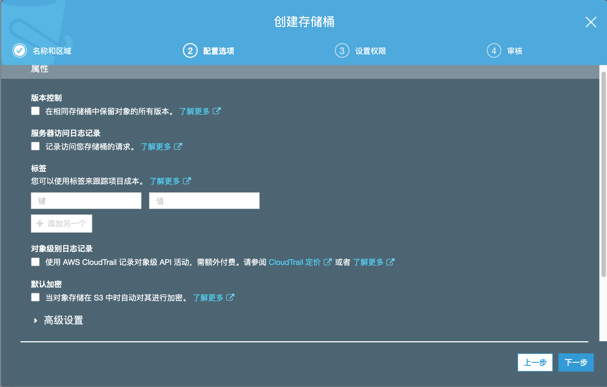

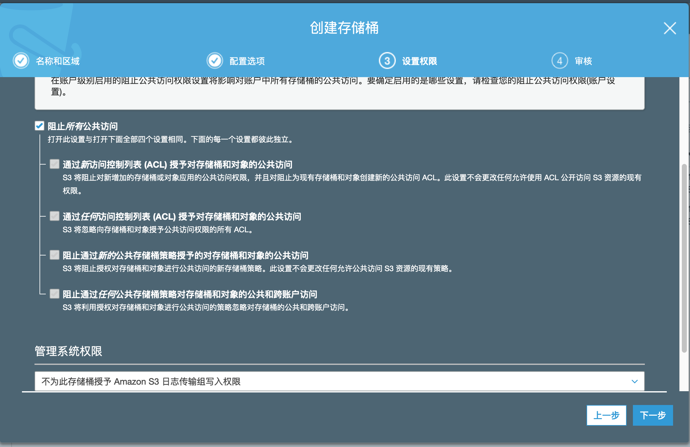

## 2. 建立Kinesis Firehose

- 进入Kinesis服务

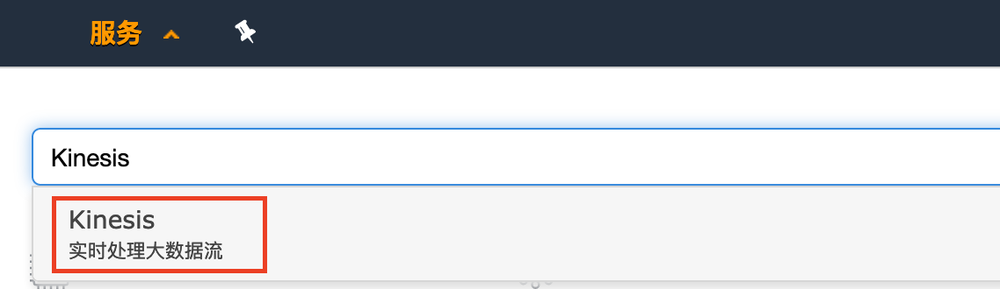

- 点击入门

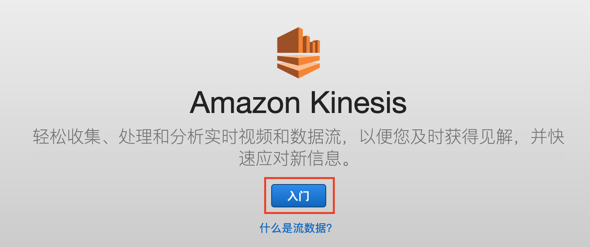

- 选择使用Kinesis Firehose，创建传送流

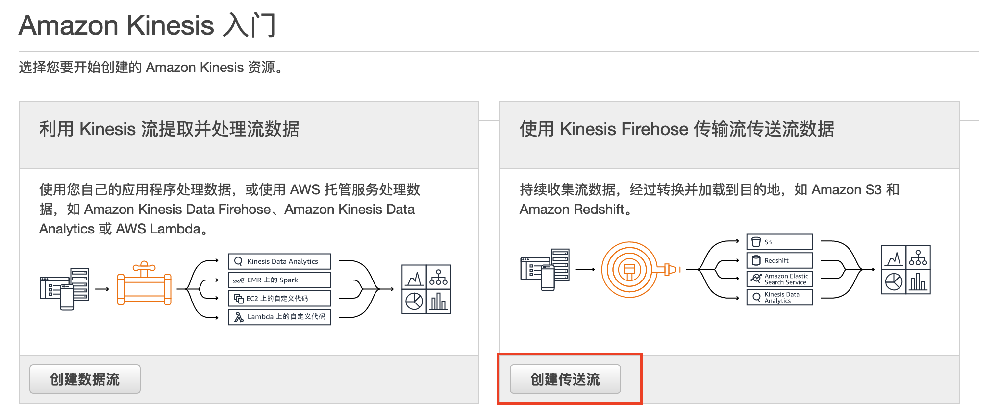

- 为新的传输流命名，这里命名为IoT-to-S3-Example

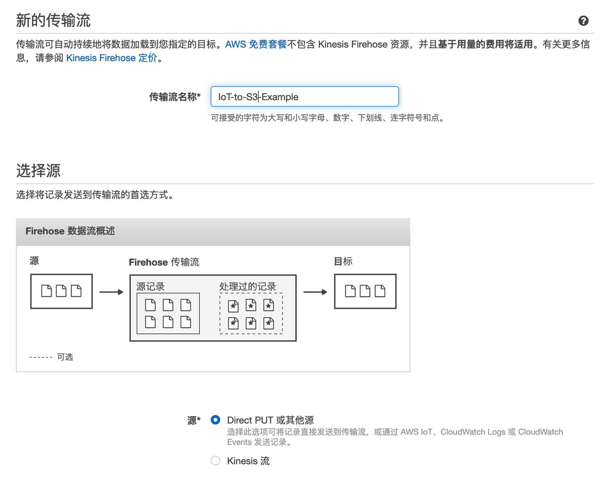

- 禁用记录转换

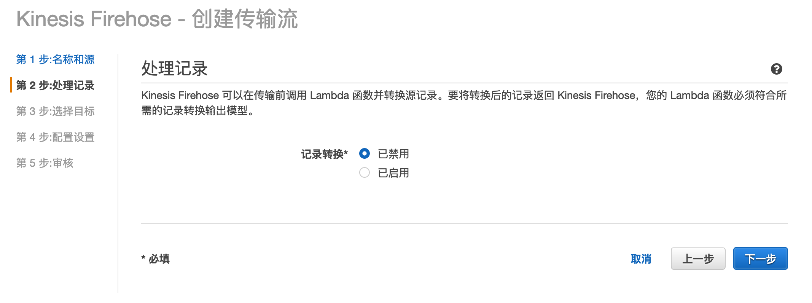

- 选择目标为S3

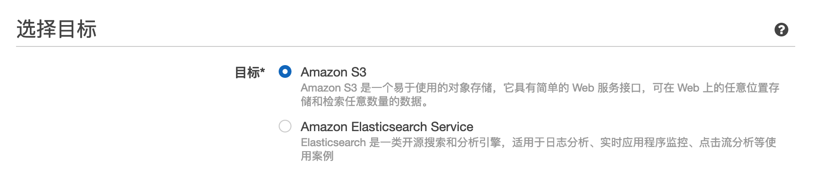

- 选择刚刚创建的S3存储桶，并加上前缀iot-to-s3-example/，然后进行到下一步

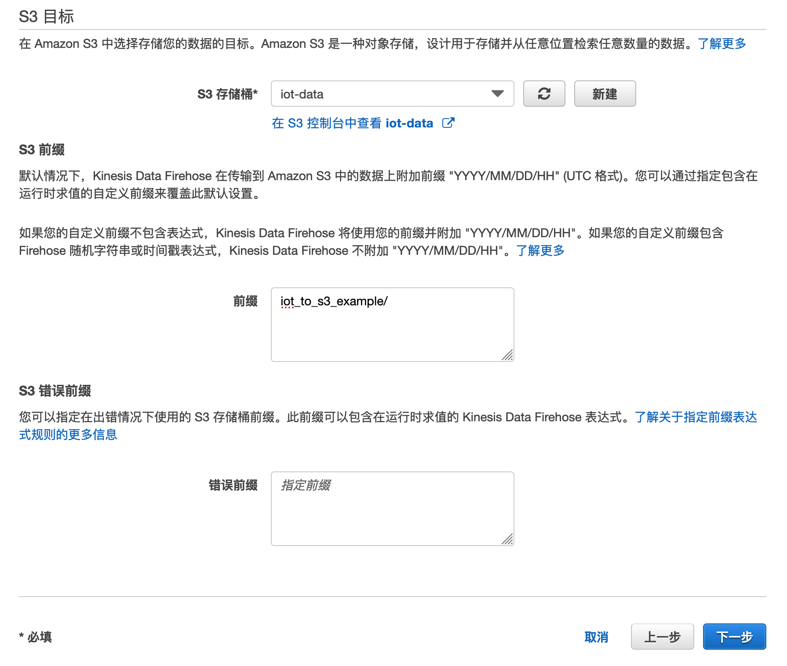

- 选择缓冲区大小为5MB，缓冲时间间隔为100秒， 并禁用S3压缩

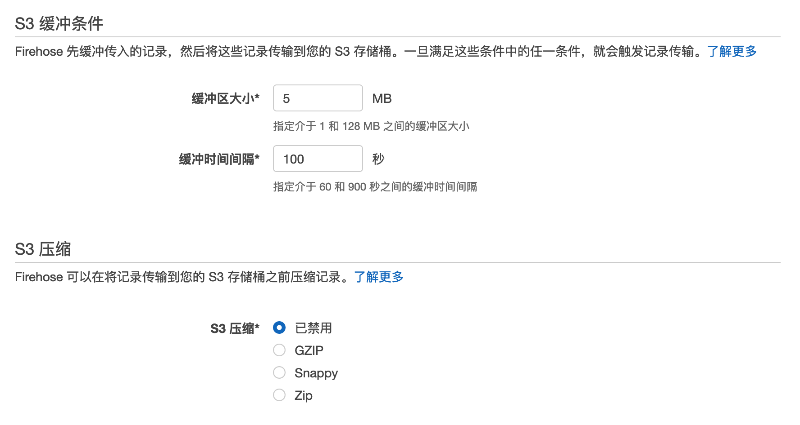

- 可选启用错误日志记录

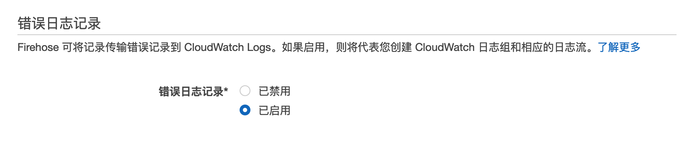

- 点击新建或选择IAM角色

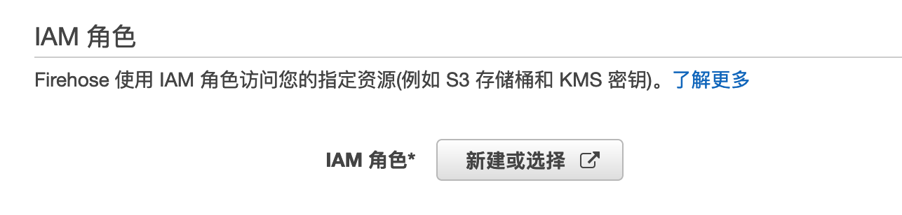

- 这时您将跳转至新的网页，按照默认的角色摘要直接创建

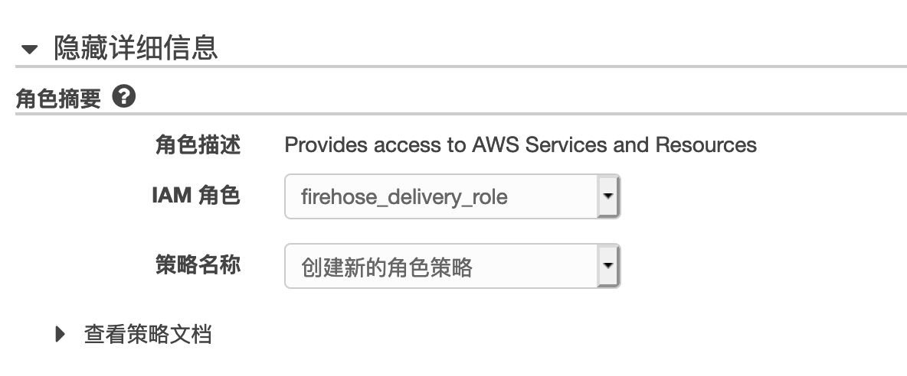

- 返回刚才的网页，您将看到创建的IAM角色，点击进行下一步

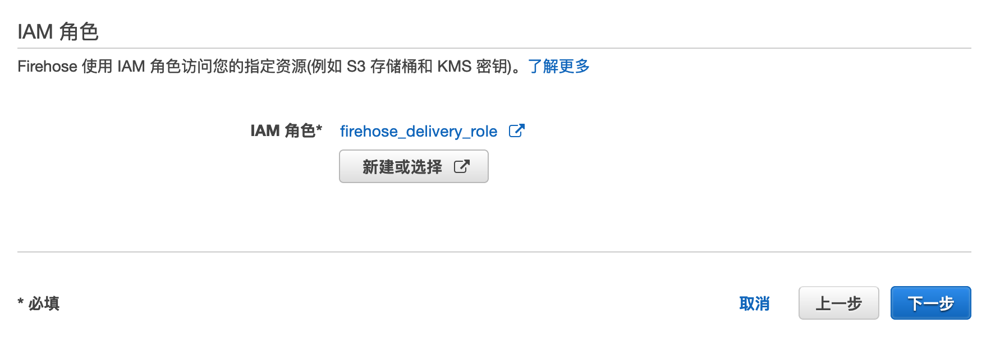

- 检查刚刚的配置后，创建传送流

- 稍等片刻，您将看到您创建的传送流状态变为活跃

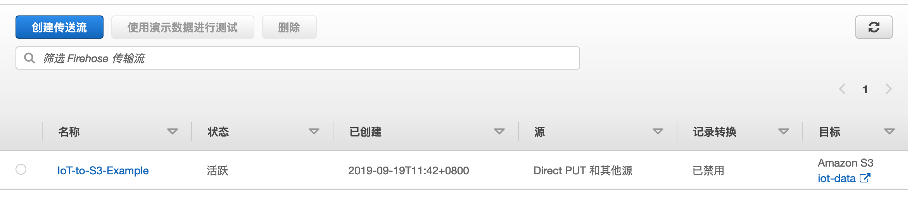