通过IoT Core Rule Egine连接AWS Kinesis Firehose， 来将IoT设备生成的实时数据存储于S3中.

- 在进行此实验前，请先完成01_connected_publish中的全部内容。

## 1. 创建S3桶

- 此S3桶用于存储IoT设备生成的所有数据

- 进入S3控制台
<a data-fancybox="gallery" href="https://iot-demo-resource.s3-ap-southeast-1.amazonaws.com/kinesis/1.png">
</a>


- 创建新的存储桶
<a data-fancybox="gallery" href="https://iot-demo-resource.s3-ap-southeast-1.amazonaws.com/kinesis/2.png">
</a>


- 给存储桶命名，这里命名为iot-data
<a data-fancybox="gallery" href="https://iot-demo-resource.s3-ap-southeast-1.amazonaws.com/kinesis/3.png">
</a>


- 之后按照默认设置创建存储桶
<a data-fancybox="gallery" href="https://iot-demo-resource.s3-ap-southeast-1.amazonaws.com/kinesis/4.png">
</a>


<a data-fancybox="gallery" href="https://iot-demo-resource.s3-ap-southeast-1.amazonaws.com/kinesis/5.png">
</a>


## 2. 建立Kinesis Firehose

- 进入Kinesis服务
<a data-fancybox="gallery" href="https://iot-demo-resource.s3-ap-southeast-1.amazonaws.com/kinesis/6.png">
</a>


- 点击入门
<a data-fancybox="gallery" href="https://iot-demo-resource.s3-ap-southeast-1.amazonaws.com/kinesis/7.png">
</a>


- 选择使用Kinesis Firehose，创建传送流
<a data-fancybox="gallery" href="https://iot-demo-resource.s3-ap-southeast-1.amazonaws.com/kinesis/8.png">
</a>


- 为新的传输流命名，这里命名为IoT-to-S3-Example
<a data-fancybox="gallery" href="https://iot-demo-resource.s3-ap-southeast-1.amazonaws.com/kinesis/9.png">
</a>


- 禁用记录转换
<a data-fancybox="gallery" href="https://iot-demo-resource.s3-ap-southeast-1.amazonaws.com/kinesis/10.png">
</a>


- 选择目标为S3
<a data-fancybox="gallery" href="https://iot-demo-resource.s3-ap-southeast-1.amazonaws.com/kinesis/11.png">
</a>


- 选择刚刚创建的S3存储桶，并加上前缀iot-to-s3-example/，然后进行到下一步
<a data-fancybox="gallery" href="https://iot-demo-resource.s3-ap-southeast-1.amazonaws.com/kinesis/12.png">
</a>


- 选择缓冲区大小为5MB，缓冲时间间隔为100秒， 并禁用S3压缩
<a data-fancybox="gallery" href="https://iot-demo-resource.s3-ap-southeast-1.amazonaws.com/kinesis/13.png">
</a>


- 可选启用错误日志记录
<a data-fancybox="gallery" href="https://iot-demo-resource.s3-ap-southeast-1.amazonaws.com/kinesis/14.png">
</a>


- 点击新建或选择IAM角色
<a data-fancybox="gallery" href="https://iot-demo-resource.s3-ap-southeast-1.amazonaws.com/kinesis/15.png">
</a>


- 这时您将跳转至新的网页，按照默认的角色摘要直接创建
<a data-fancybox="gallery" href="https://iot-demo-resource.s3-ap-southeast-1.amazonaws.com/kinesis/16.png">
</a>


- 返回刚才的网页，您将看到创建的IAM角色，点击进行下一步
<a data-fancybox="gallery" href="https://iot-demo-resource.s3-ap-southeast-1.amazonaws.com/kinesis/17.png">
</a>


- 检查刚刚的配置后，创建传送流
<a data-fancybox="gallery" href="https://iot-demo-resource.s3-ap-southeast-1.amazonaws.com/kinesis/18.png">
</a>


- 稍等片刻，您将看到您创建的传送流状态变为活跃
<a data-fancybox="gallery" href="https://iot-demo-resource.s3-ap-southeast-1.amazonaws.com/kinesis/19.png">
</a>


## 3. 创建IoT rule

- 在进行此步骤之前请确保01_connect_publish中的步骤都完成了，您将已经注册好了一个IoT设备，并能启动Cloud9

- 进入IoT服务页面
<a data-fancybox="gallery" href="https://iot-demo-resource.s3-ap-southeast-1.amazonaws.com/kinesis/20.png">
</a>

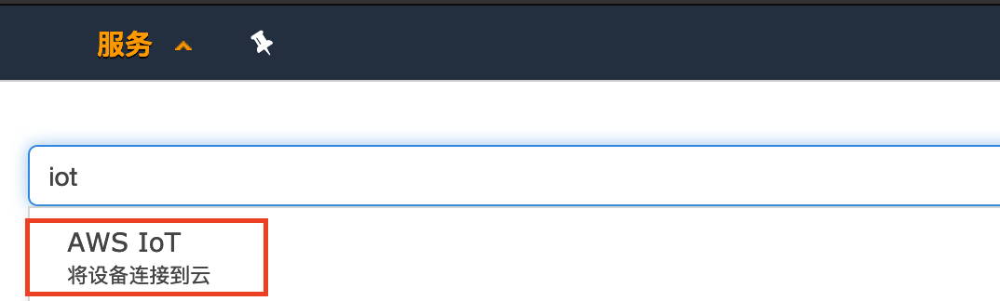

- 进入IoT的行动板块，选择创建规则
<a data-fancybox="gallery" href="https://iot-demo-resource.s3-ap-southeast-1.amazonaws.com/kinesis/21.png">
</a>

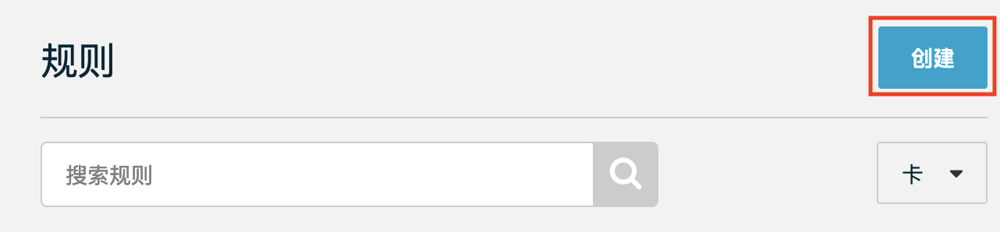

- 给规则命一个名称，这里命名为iot_to_ki_demo_rule
<a data-fancybox="gallery" href="https://iot-demo-resource.s3-ap-southeast-1.amazonaws.com/kinesis/22.png">
</a>

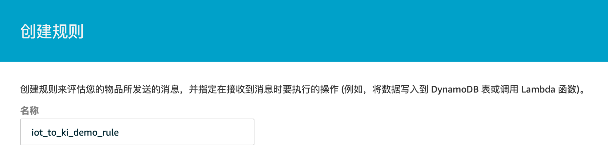

- 在规则查询语法中输入

```SQL
SELECT *, timestamp() as timestamp FROM 'connectedcar/#'
```

<a data-fancybox="gallery" href="https://iot-demo-resource.s3-ap-southeast-1.amazonaws.com/kinesis/23.png">
</a>

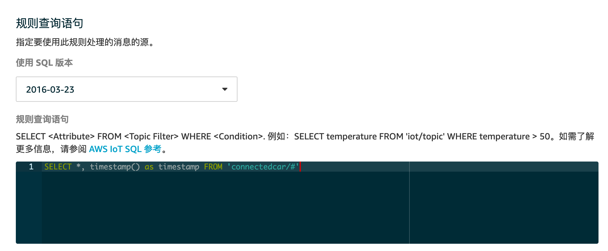

- 添加操作
<a data-fancybox="gallery" href="https://iot-demo-resource.s3-ap-southeast-1.amazonaws.com/kinesis/24.png">
</a>

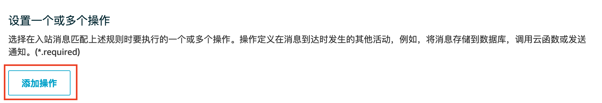

- 选择将消息发送到Amazon Kinesis Firehose流
<a data-fancybox="gallery" href="https://iot-demo-resource.s3-ap-southeast-1.amazonaws.com/kinesis/25.png">
</a>

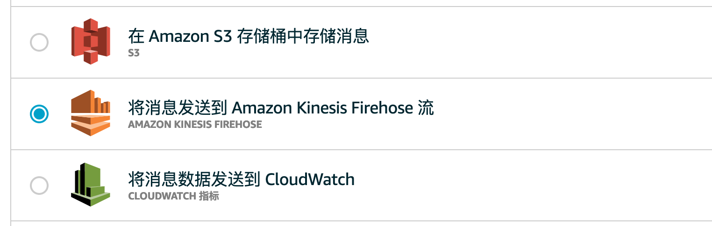

- 在配置操作中选择您刚刚创建的Kinesis Firehose流，分割符就用“，“，角色选择在02_data_visualize中创建的iot-es-action-rule
<a data-fancybox="gallery" href="https://iot-demo-resource.s3-ap-southeast-1.amazonaws.com/kinesis/26.png">
</a>

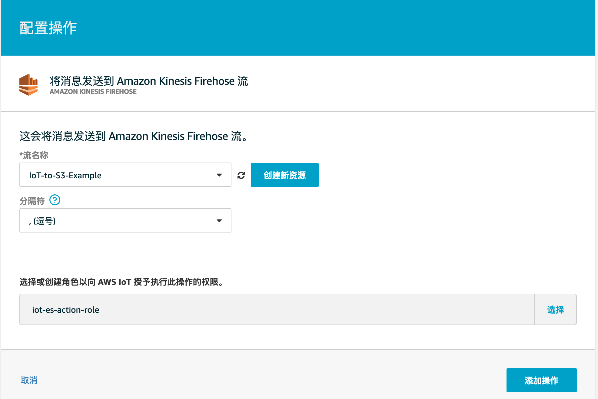

- 检查没有问题后可以创建规则
<a data-fancybox="gallery" href="https://iot-demo-resource.s3-ap-southeast-1.amazonaws.com/kinesis/27.png">
</a>

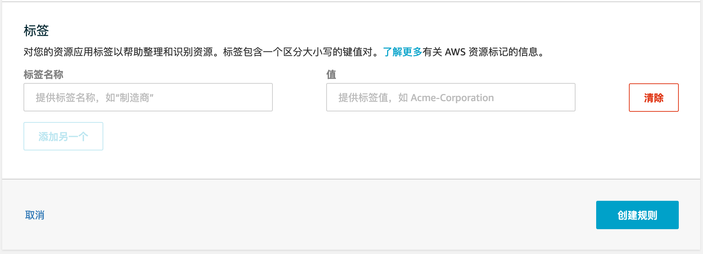

## 4. 测试

- 在进行了01_connect_publish后，您将拥有一个由CloudFormation创建的Cloud9（IDE）
<a data-fancybox="gallery" href="https://iot-demo-resource.s3-ap-southeast-1.amazonaws.com/kinesis/28.png">
</a>

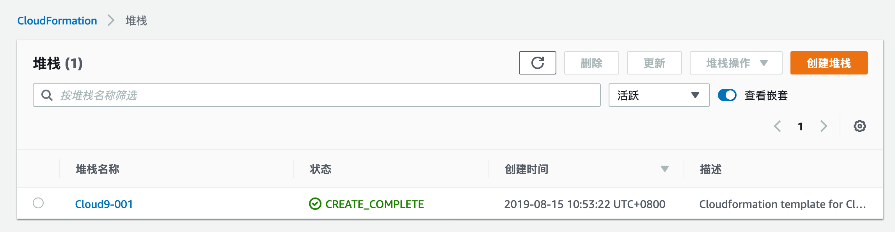

- 请按照01_connect_publish中的步骤启动Cloud9并确认相应文件都已经上传。这时可以在Cloud9中用python运行car.py文件，这时您将在终端看到不断上传的数据。

```sh
python3 car_publish.py
```

<a data-fancybox="gallery" href="https://iot-demo-resource.s3-ap-southeast-1.amazonaws.com/kinesis/29.png">
</a>

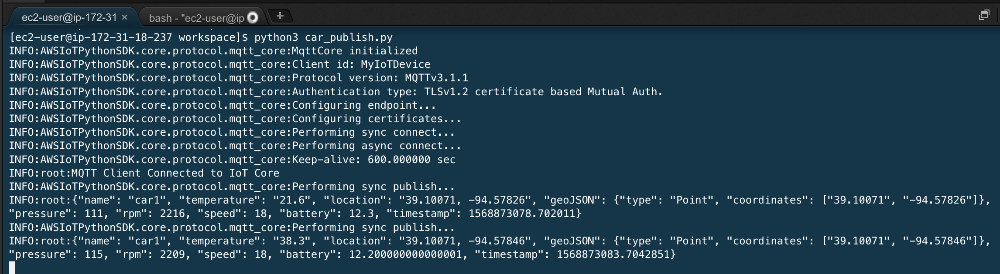

在IoT测试中使用connectedcar/#来订阅上传的信息
<a data-fancybox="gallery" href="https://iot-demo-resource.s3-ap-southeast-1.amazonaws.com/kinesis/30.png">
</a>

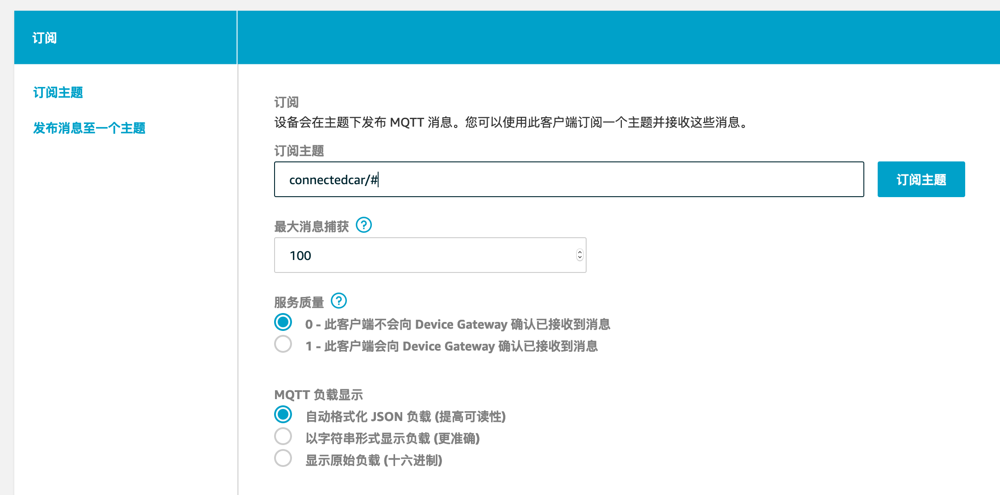

- 这是应该接收到的输出
<a data-fancybox="gallery" href="https://iot-demo-resource.s3-ap-southeast-1.amazonaws.com/kinesis/31.png">
</a>

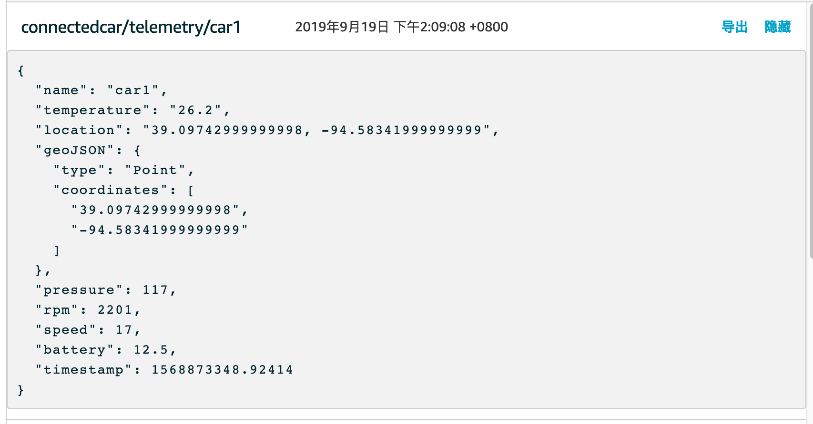

- 进入Kinesis控制台，选择进入刚刚创建的传输流，在监控部分可以看到不断上传的文件
<a data-fancybox="gallery" href="https://iot-demo-resource.s3-ap-southeast-1.amazonaws.com/kinesis/32.png">
</a>

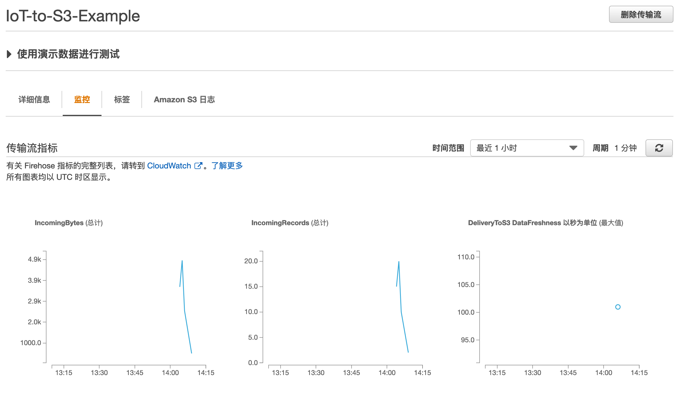

- 进入您在S3中在步骤1中创建的桶中，您将看到不断上传的数据存储在了子文件夹中
<a data-fancybox="gallery" href="https://iot-demo-resource.s3-ap-southeast-1.amazonaws.com/kinesis/33.png">
</a>

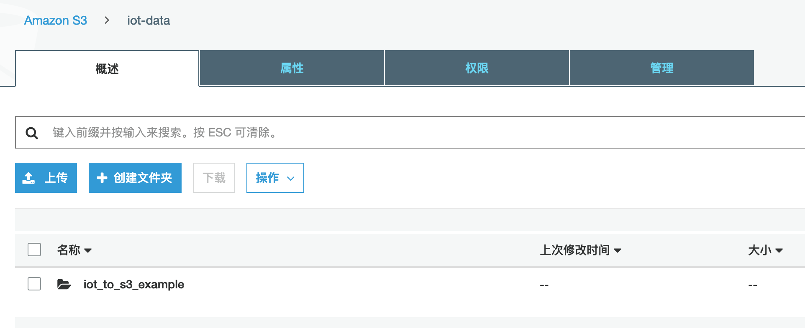


